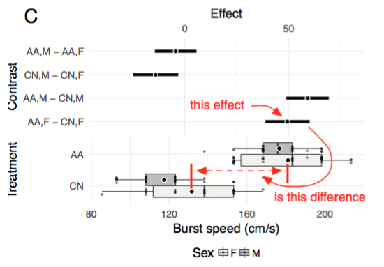

### What this app does

Recommended best practices for the reporting of statistical results include 1) showing the raw data and/or distribution of data in plots and focusing on 2) effect size and 3) uncertainty in effect estimates instead of _p_-values of null hypothesis tests. By contrast, standard practice throughout experimental biology includes the reporting of ANOVA results in tables and treatment means and standard errors in plots. At best, ANOVA tables poorly communicate effect size and uncertainty. Effects and uncertainty can be inferred from plots of treatment means and standard errors only indirectly.

The Harrell plot addresses all three recommended practices by combining into a single plot a forest plot of modeled treatment effects and a box plot with superimposed jittered dots to show the distribution of data within groups. The illustrated effects in the forest plot part can be the coefficients of the linear model or contrasts between treatment combinations. If contrasts, these can be comparisons with a reference (such as a control) or pairwise comparisons.

The raw data are shown in the lower part of the plot using jittered dots, clustered by group. The distribution of data in each group is also shown in the lower part of the plot using a box plot. The precise tool to show the data and distributions is flexible but jittered dots and box plot reflect the best practice for much of experimental biology. While some advocate the use of an error bar, the box plot is more informative than an interval based on the sample standard deviation (including the sample confidence interval). And, an interval based on the standard error of the mean (including a 95% confidence interval of the mean) is typically not the uncertainty that we want to communicate.

### Data tab -- Importing data
HarrellPlot imports both tab-delimited (.txt) and comma-separated (.csv) files. The files should have a header row of column labels. The files cannot have leading, commented (#) rows.

Factor levels are automatically ordered in the order that they first appear in a column. To re-order factor levels, it is easiest to sort prior to importing into HarrellPlot

### Model tab -- Choosing the variables to plot by modeling the data
**Response** (required) is the Y variable. This should be numeric.

**Treatment 1** (required) is the X variable for the plot. This should be categorical (if numeric, it will be treated as categorical).

**Treatment 2** (optional) is a second factor that can be thought of as a grouping variable for the purpose of plotting. This should be categorical. If specified, three check boxes appear. The first (add interaction) adds the interaction between the Treatment 1 and Treatment 2 factors to the model. The within Treatment 1 and within Treatment 2 boxes specify which sets of contrasts to display (both can be checked simultaneously)

**Covariate(s)** (optional) are X variables that can be added to a model but are not explicitly plotted. These can be categorical or numerical.

**Model** At the present, fixed effects from both general linear models (lm) and simple linear mixed models (lmm) can be plotted. Generalized linear models will be added shortly. If lmm is chosen, two more variable select boxes are added:

**Random Intercept** is the variable that identifies the cluster (or subject or block or grouping variable)

**Random Slope**

### Plot tab -- Modifying plot features

### Tables tab -- displays multiple tables of the model results

### Save tab -- Exports the plots
